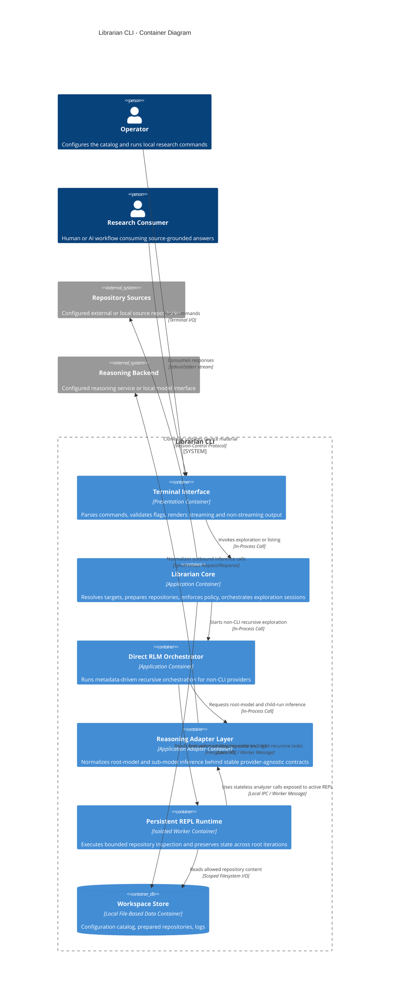
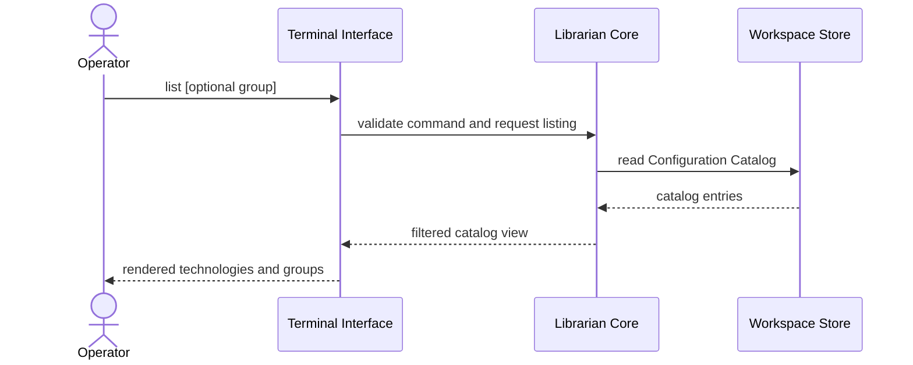
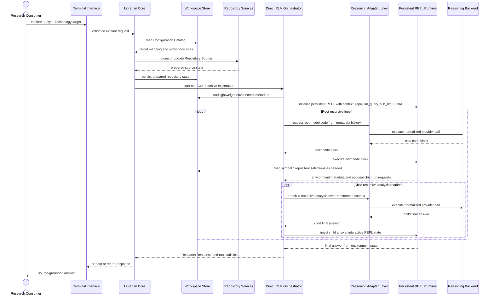
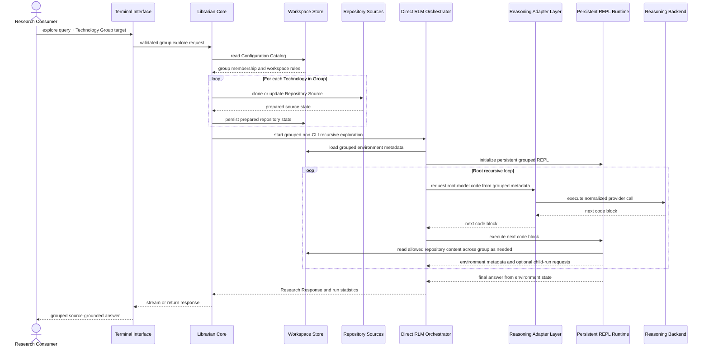

# Architecture: Librarian CLI

This document translates the current [PRD](/home/oscar/GitHub/librarian/docs/PRD.md) into a logical architecture. It remains vendor-agnostic and is intentionally optimized for a solo developer operating a local-first product.

For non-CLI recursive exploration semantics, this document uses *Recursive Language Models* (Zhang, Kraska, Khattab, arXiv:2512.24601v2) as the authoritative behavioral reference: the prompt lives in the environment, the root model operates over metadata, code executes in a persistent REPL, recursion launches child RLM runs, and normal completion comes from environment state.

## 1. Architectural Strategy

### The Pattern

**Modular Monolith with a Direct RLM Orchestrator, Persistent REPL Runtime, and Local Workspace Persistence**

### Justification

This system does not justify the operational cost of microservices. The product is local-first, has a narrow command surface, and serves synchronous, bounded research workflows rather than high-throughput multi-tenant traffic. Following Martin Fowler's "Monolith First" guidance, the correct architectural move is one cohesive application with strong internal boundaries, not a distributed system that pays the microservices premium before the product has earned it.

For the non-CLI `explore` path, the architectural meaning of "RLM" follows Algorithm 1 from the paper rather than generic agentic tooling. That means the architecture must preserve the paper's core properties instead of approximating them with prompt stuffing, compaction, or nested script execution.

The architecture should therefore separate concerns inside one primary application boundary:

- **Command Surface Context**: parses commands, validates user intent, and controls output mode.
- **Catalog Context**: resolves Technologies and Technology Groups from the operator-managed catalog.
- **Repository Preparation Context**: prepares the evidence boundary by cloning, updating, or validating Repository Sources.
- **Research Orchestration Context**: manages the Exploration Session lifecycle, drives the root recursive loop, and keeps root-model history metadata-sized.
- **Reasoning Adapter Context**: normalizes non-CLI model access behind stable root-model and sub-model contracts while keeping CLI-backed providers on their provider-native subprocess path.
- **Persistent Runtime Context**: maintains the long-lived REPL environment for non-CLI recursive sessions, including locals, helper functions, symbolic selections, and final-answer bindings.
- **Recursive Analysis Context**: launches child recursive runs over transformed context rather than treating recursion as nested code evaluation.
- **Workspace Guardrail Context**: enforces path boundaries, allowed scopes, and local persistence rules.
- **Observability Context**: records structured, redacted, session-oriented telemetry for diagnosis.

### Logical Mechanisms

- **Primary application mechanism:** Single local application process.
- **Root control mechanism:** Root model operates over environment metadata and execution history summaries, not over a prebuilt full repository digest.
- **Isolation mechanism:** Separate isolated runtime for bounded repository investigation.
- **State mechanism:** A persistent REPL session retains local bindings, helper functions, symbolic selections, and final-answer state across root iterations.
- **Recursion mechanism:** Child recursive analysis creates fresh child orchestration runs over transformed prompt/context pairs.
- **Persistence mechanism:** Local file-based document storage for configuration and logs, plus a filesystem-backed working set for prepared repositories.
- **Environment contract mechanism:** Repository access is exposed as a stable symbolic environment contract rather than an unstable mix of formatted text and structured output.
- **Provider abstraction mechanism:** Non-CLI inference is normalized through a dedicated model-adapter layer so the recursive loop is owned by Librarian rather than by a framework-managed agent loop.
- **External dependency mechanism:** Synchronous outbound calls to Repository Sources and a configured Reasoning Backend.
- **Coordination mechanism:** In-process orchestration. No message queue is logically required at this stage.

### Architectural Decisions

- **No relational database is required** because the product state is operator-scoped, local, and configuration-driven.
- **No event bus is required** because exploration sessions are initiated synchronously and completed in the same user workflow.
- **No API gateway or hosted service plane is required** because the PRD explicitly centers a local CLI operating model.

## 2. System Containers (C4 Level 2)

- **Terminal Interface**: Presentation Container - Accepts commands, validates flags, and renders list, stream, and error output.
- **Librarian Core**: Application Container - Orchestrates catalog resolution, repository preparation, session lifecycle, and outbound adapter calls.
- **Direct RLM Orchestrator**: Application Container - Runs the root recursive loop for non-CLI providers, manages root-model history, and coordinates child recursive runs.
- **Reasoning Adapter Layer**: Application Adapter Container - Implements stable root-model and sub-model contracts for non-CLI providers and isolates provider-specific inference details from orchestration.
- **Persistent REPL Runtime**: Isolated Worker Container - Executes bounded repository inspection and preserves active runtime state across root iterations.
- **Workspace Store**: Local File-Based Data Container - Stores the Configuration Catalog, prepared repository working copies, and structured logs.

### External Systems

- **Repository Sources**: External Version-Control System - Provides the canonical source material for each Technology.
- **Reasoning Backend**: External Inference System - Produces synthesized reasoning for an Exploration Session from bounded repository evidence.

## 3. The Container Diagram (Mermaid)

## 4. Critical Execution Flows (Sequence Diagrams)

### Flow 1: List Available Technologies and Groups

### Flow 2: Explore a Single Technology

### Flow 3: Explore a Technology Group

## 5. Resilience & Cross-Cutting Concerns

### Authentication Strategy

- The primary trust boundary is the local operating-system user who executes the application.
- There is no separate end-user identity domain inside the product at this stage.
- Credentials for the Reasoning Backend are operator-scoped secrets and must only be materialized inside the outbound adapter path, never propagated into the Research Sandbox Runtime unless strictly required for inference calls.
- Every Exploration Session should carry a generated correlation identifier across Terminal Interface, Librarian Core, Research Sandbox Runtime, and logs.

### Failure Handling

- **Repository access timeout:** Repository preparation must have bounded timeouts so a slow remote source cannot block the session indefinitely.
- **Repository retry policy:** Limited retries are logically appropriate for transient remote repository failures. Permanent target-resolution or sandbox-boundary failures must fail immediately without retry.
- **Reasoning backend circuit breaker:** The outbound reasoning adapter should open after repeated backend failures to avoid repeated long waits during a degraded provider incident.
- **Reasoning backend timeout:** Synthesis requests must be time-bounded and surfaced as explicit session failures.
- **Worker bulkhead:** Each Exploration Session runs in an isolated runtime boundary so a failed or hung research execution does not corrupt the Librarian Core state.
- **Typed environment failures:** Repository and environment operations must surface typed failures into orchestration metadata instead of degrading into ordinary task strings.
- **Completion integrity:** Fallback summarization may exist as last-resort recovery, but normal completion must come from explicit environment-owned final-answer state.
- **Fail-fast group policy:** Group exploration must fail loudly if the evidence boundary cannot be prepared deterministically. Silent partial success would violate the product promise of explicit scope.

### Observability Strategy

- Use structured logging for every session stage: command receipt, target resolution, repository preparation, sandbox start, outbound synthesis, completion, and failure.
- Redact secrets and sensitive local paths from logs while preserving enough metadata for diagnosis.
- Record timing for all critical stages so operators can distinguish repository latency, reasoning latency, and local execution latency.
- Correlate all session events with the same session identifier so a single failed exploration is diagnosable end to end.
- Record recursive execution accounting for each non-CLI exploration:
  root iteration count, child-run count, provider-call count, repository-call count, prompt size, output size, and total duration.

## 6. Logical Risks & Technical Debt

- **Repository freshness on the critical path:** Preparing repositories during the request path improves evidence quality but makes response latency depend directly on remote source availability.
- **Group scope expansion risk:** Group exploration can become slower and less predictable as the number or size of Technologies grows, creating response-time and context-window pressure.
- **Truthful-runtime risk:** If the documented prompt contract diverges from actual runtime behavior, the root model will program against false assumptions and exploration quality will collapse.
- **Fake-persistence risk:** A worker model that preserves only exported buffers rather than full execution state undermines the core promise of a recursive REPL.
- **Recursion-semantics risk:** If child analysis is implemented as nested code execution instead of child recursive orchestration, the system will remain agentic in spirit but not aligned with strict RLM semantics.
- **Security-boundary ambiguity:** A workspace-bounded runtime is appropriate for trusted local use, but it is not a sufficient architecture for adversarial multi-tenant execution.
- **Single-process bottleneck:** Keeping orchestration in one local process is the right current tradeoff, but long-running or concurrent exploration sessions could compete for CPU, memory, and terminal responsiveness.
- **Backend variability risk:** Supporting multiple Reasoning Backend modes increases product flexibility but creates a wider surface for timeout, streaming, and capability inconsistency.
- **Local state integrity risk:** Prepared repositories and local logs live in operator-managed storage, so corruption, partial writes, or disk pressure can degrade the product without a separate data service to absorb the failure.

## 7. Reference Sources

- Recursive Language Models paper: https://arxiv.org/html/2512.24601v2
- AI SDK Foundations Overview: https://ai-sdk.dev/docs/foundations/overview.md
- AI SDK Providers and Models: https://ai-sdk.dev/docs/foundations/providers-and-models.md
