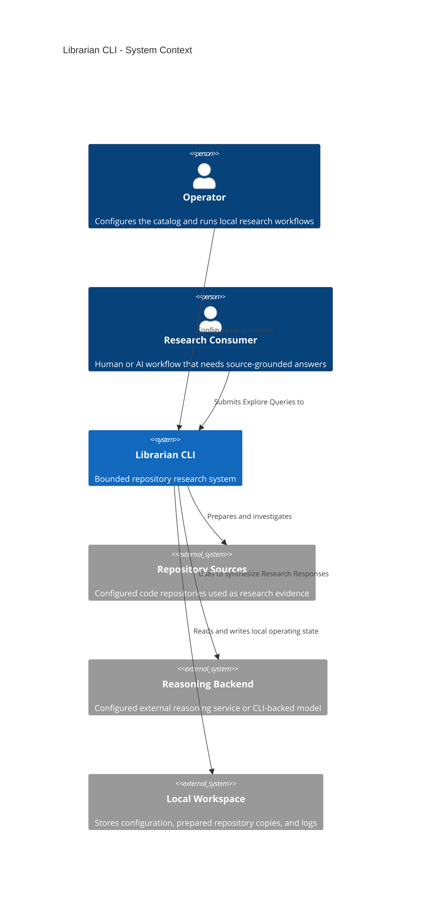
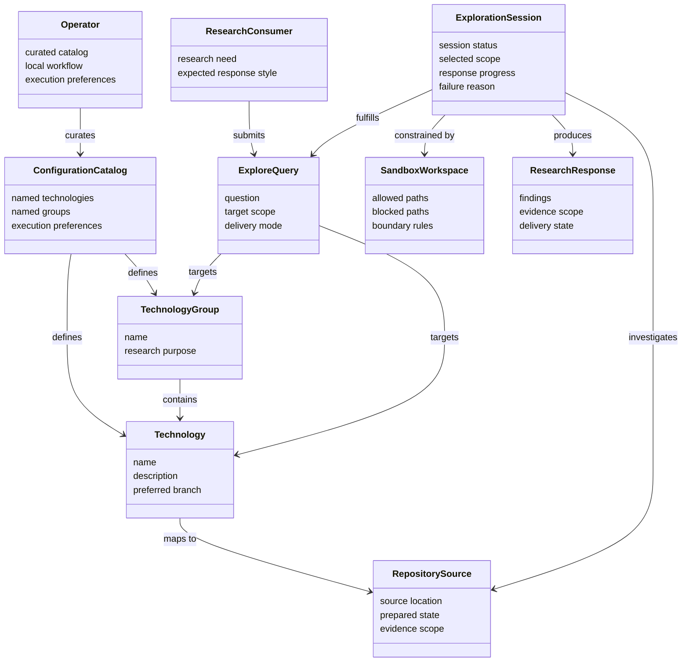

# Product Requirements Document: Librarian CLI

This PRD is written as a brownfield baseline. It codifies the product that already exists today, clarifies its intended problem space, and sets scope boundaries without prescribing solution design beyond the product layer.

## 1. Executive Summary

### The Vision

Librarian CLI exists to be the dependable research surface that AI coding agents and their operators use when they need fast, source-grounded understanding of a known technology codebase. Its value is not generic answer generation. Its value is bounded, repeatable investigation inside explicitly curated repository scope.

### The Problem

AI coding workflows often need answers that are grounded in the actual source of a framework, library, or related ecosystem project. General-purpose model answers are too easy to trust and too hard to verify. Operators also need a lightweight way to curate which technologies are allowed for investigation, rather than giving agents unconstrained access to local files or the open web.

### Jobs To Be Done

- When an AI coding agent needs to understand how a technology behaves, it hires Librarian CLI to investigate the relevant source repository and return a usable research response within an explicit evidence boundary.
- When an operator wants consistent, repeatable agent research, they hire Librarian CLI to maintain a curated catalog of technologies and groups, then route exploration through a predictable command surface.
- When a user needs cross-repository comparison within a known ecosystem, they hire Librarian CLI to investigate a named group rather than assembling ad hoc repository context manually.

### Brownfield Baseline

The current product baseline already includes:

- Catalog discovery of available technologies and groups.
- Exploration against a single technology or an entire group.
- Automatic preparation of repository context before research.
- Bounded investigation within an allowed workspace.
- Local, operator-controlled configuration and execution.
- Separate execution models for CLI-backed and non-CLI-backed research paths.

## 2. Ubiquitous Language (Glossary)

| Term | Definition | Do Not Use |
| --- | --- | --- |
| Operator | The person who installs, configures, and runs Librarian CLI in a local workflow. | Admin, maintainer, end user |
| Research Consumer | The human or AI workflow that receives the research response from Librarian CLI. | Assistant, bot, caller |
| Technology | A named research target mapped to one repository source. | Repo, package, project |
| Technology Group | A named collection of Technologies explored together as one scope. | Stack, namespace, bundle |
| Repository Source | The canonical code source that Librarian prepares and investigates for a Technology. | Mirror, cache, folder |
| Explore Query | A natural-language research request aimed at a Technology or Technology Group. | Prompt, ask, command text |
| Exploration Session | One end-to-end research run from target resolution through answer delivery. | Job, run, scan |
| Configuration Catalog | The persistent operator-defined catalog of Technologies, Groups, and execution preferences. | Settings file, registry |
| Sandbox Workspace | The allowed file boundary inside which an Exploration Session may inspect content. | Filesystem access, machine access |
| Research Response | The answer produced from the selected evidence boundary for the Explore Query. | Output, completion, guess |

## 3. Actors & Personas

### The Workflow-Driven Operator

This user values repeatability over improvisation. They want a small command surface, explicit scope control, and low-friction setup. They are comfortable curating a catalog up front if it means agents become safer and more predictable afterward. They do not want to hand-hold every research session.

### The Evidence-Hungry AI Coding Agent

This user values grounded answers over broad speculation. It wants a tool it can call programmatically, with clear target selection and consistent response behavior. It prefers strong scope boundaries because those reduce ambiguity, not because they are merely restrictive.

## 4. Functional Capabilities

### Epic A: Catalog Discovery & Scope Selection

- `P0` User can define a catalog of Technologies and Technology Groups that represent the only allowed research targets.
- `P0` User can list the available Technologies and Technology Groups before starting research.
- `P0` User can target either one Technology or one Technology Group per Explore Query.
- `P1` User can associate descriptive metadata with each Technology so the catalog is understandable without opening the repository first.

### Epic B: Source-Grounded Research

- `P0` User can submit an Explore Query against a single Technology and receive a Research Response grounded in that Technology's Repository Source.
- `P0` User can submit an Explore Query against a Technology Group and receive a Research Response grounded in the grouped Repository Sources.
- `P0` User can receive the Research Response incrementally for longer sessions, with a non-streaming fallback.
- `P1` User can expect Librarian CLI to prepare repository context before the Exploration Session begins so the response reflects the intended repository state.
- `P1` User can rely on non-CLI recursive research modes to inspect repository metadata first and materialize only relevant repository slices during exploration, rather than front-loading a fixed repository digest.
- `P1` User can rely on recursive research modes to preserve intermediate working state across steps and produce the final response from that active session state.

### Epic C: Bounded Investigation

- `P0` User can trust that each Exploration Session is limited to the Sandbox Workspace associated with the selected Technology or Technology Group.
- `P0` User receives explicit failure when target selection is invalid, configuration is incomplete, or requested scope is unavailable.
- `P0` User is protected from accidental scope expansion outside the selected research boundary.
- `P1` User can rely on the product to respect operator-defined content boundaries that keep irrelevant or hidden material out of normal investigation flows.
- `P1` User can rely on repository-access and environment contracts that remain stable enough for recursive research runs to manipulate evidence symbolically, not only as prettified terminal text.

### Epic D: Operator-Controlled Execution

- `P0` User can run Librarian CLI locally without needing a hosted control plane.
- `P1` User can choose the reasoning backend through configuration without changing the product workflow.
- `P1` User can use either remote or local Repository Sources in the Configuration Catalog.
- `P1` User can inspect where the active configuration lives as part of local workflow management.

### Epic E: Product Maturity & Usability

- `P1` User can onboard through a minimal default path rather than assembling the entire Configuration Catalog from scratch.
- `P1` User can rely on clear terminal-oriented messaging for success, failure, and scope errors.
- `P2` User can fit Librarian CLI into different local installation patterns without changing the conceptual workflow.

## 5. Non-Functional Constraints

- **Scalability:** The product must continue to support a growing catalog of Technologies and grouped research targets without changing the command model or forcing operators into a more complex orchestration layer.
- **Security:** The product must enforce workspace-bounded investigation and reject out-of-scope path access. It must not be positioned as hardened isolation for hostile multi-tenant workloads.
- **Availability:** The product must fail loudly and specifically when configuration, repository access, or reasoning backend access is unavailable. Silent degradation is unacceptable.
- **Freshness:** Research should be based on the prepared repository state for the selected target rather than stale cached assumptions.
- **Correctness:** Non-CLI recursive research modes must behave truthfully with respect to their documented runtime contract, especially around state persistence, symbolic recursion, and final-answer completion semantics.
- **Accessibility:** Core workflows must remain terminal-friendly, plain-text readable, and easy for both humans and automation to parse.
- **Observability:** Operators need enough logging and error clarity to diagnose failed sessions without exposing sensitive credentials or local secrets.

## 6. Boundary Analysis

### In Scope

- Curated, operator-controlled research against explicitly named Technology and Technology Group targets.
- Source-grounded answers derived from Repository Sources inside a bounded workspace.
- Local CLI execution that fits into AI coding workflows and developer terminals.
- A narrow command surface focused on discovery, exploration, and configuration visibility.

### Out of Scope

- General-purpose answering outside configured Repository Sources.
- Arbitrary filesystem exploration across the operator's machine.
- Code authoring, repository modification, or automated patch generation against researched sources.
- Hosted collaboration features such as shared dashboards, team administration, or cloud session management.
- Security claims that imply hardened containment for adversarial or zero-trust execution contexts.
- Broad configuration management inside the CLI beyond the minimal visibility needed to locate active configuration.

## 7. Conceptual Diagrams (Mermaid)

### Diagram A: Context (C4 Level 1)

### Diagram B: Domain Model

