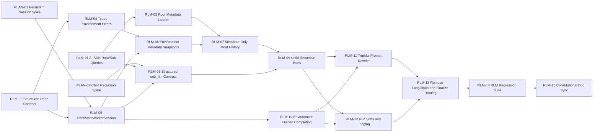

# Execution Plan: Librarian CLI

This plan decomposes the current [TechSpec](/home/oscar/GitHub/librarian/docs/TechSpec.md) into atomic brownfield tasks for the next implementation phase. It is intentionally constrained to strict non-CLI `explore` alignment against *Recursive Language Models* (Zhang, Kraska, Khattab, arXiv:2512.24601v2), especially metadata-only root control, persistent REPL state, symbolic recursion, and environment-owned completion.

Following Goldratt's Theory of Constraints, the bottleneck is not "LLM quality"; it is the runtime-contract chain. The critical path is therefore routing -> metadata contract -> persistent session -> child recursion -> completion semantics -> verification.

Execution grounding for the provider-adapter work is intentionally tied to current AI SDK documentation rather than inferred framework behavior:

- AI SDK Foundations Overview: https://ai-sdk.dev/docs/foundations/overview.md
- AI SDK Providers and Models: https://ai-sdk.dev/docs/foundations/providers-and-models.md
- AI SDK Core `generateText()`: https://ai-sdk.dev/docs/reference/ai-sdk-core/generate-text.md

## 1. Executive Summary

- **Total Estimation:** 52 story points for Phase 1 strict RLM alignment.
- **Critical Path:** `PLAN-01 -> RLM-01 -> RLM-02 -> RLM-03 -> RLM-05 -> RLM-06 -> RLM-07 -> RLM-08 -> RLM-09 -> RLM-10 -> RLM-11 -> RLM-12 -> RLM-13 -> RLM-14 -> RLM-15`

## 2. Project Phasing Strategy

### Phase 1 (MVP)

- Non-CLI providers enter a direct internal RLM orchestration path backed by AI SDK model adapters, and LangChain is removed from the product runtime.
- The root controller sees metadata-sized repository context, not a prebuilt README and source preload.
- The runtime behaves like a real persistent REPL across root iterations, preserving locals, helper functions, symbolic selections, and final-answer bindings.
- `sub_rlm()` launches child recursive runs over structured `{ prompt, context, rootHint? }` input.
- Final answers come from environment state via `FINAL()` or `FINAL_VAR()`, with fallback summarization treated as recovery-only.
- Logs and tests prove RLM semantics rather than generic "agent succeeded" behavior.

### Phase 2 (Post-Launch)

- Add richer symbolic repository helpers such as `repo.readMany()`, `repo.readChunk()`, and `repo.concat()`.
- Extract the brownfield codebase incrementally toward the target `domain` / `application` / `infrastructure` layout defined in the Tech Spec.
- Introduce the optional loopback-only automation adapter after the CLI and orchestration contracts stabilize.

## 3. Build Order (Dependency Graph)

Brownfield note: there is no application database in scope because ADR-002 explicitly rejects one. There is also no separate frontend track. The graph therefore uses the actual delivery lanes for this repo: contract repair, runtime, orchestration, integration, and verification.



## 4. Ticket List

### Epic A: Risk Spikes

**[PLAN-01] Spike Persistent Worker Session Strategy**
- **Type:** Spike
- **Effort:** 3
- **Dependencies:** None
- **Description:** Prove the replacement shape for the current worker lifecycle in [`src/agents/rlm-worker-sandbox.ts`](/home/oscar/GitHub/librarian/src/agents/rlm-worker-sandbox.ts) so the main loop can preserve actual REPL state across multiple executes without relying on buffer rehydration.
- **Acceptance Criteria (Gherkin):**
```gherkin
Given the current per-execute worker recreation behavior
When the spike is completed
Then the team has a documented session lifecycle, IPC shape, and failure policy for a long-lived worker-backed REPL
```

**[PLAN-02] Spike Child Recursive Run Contract**
- **Type:** Spike
- **Effort:** 2
- **Dependencies:** None
- **Description:** Time-box the design of the `sub_rlm({ prompt, context, rootHint? })` contract, including how child runs return final answers, stats, and typed failures back into the parent REPL.
- **Acceptance Criteria (Gherkin):**
```gherkin
Given the current sub_rlm(scriptCode) behavior
When the spike is completed
Then the team has a documented request and response contract for child recursive runs with explicit parent-child boundaries
```

### Epic B: Runtime Contract Repair

**[RLM-01] Split Root and Sub Model Query Factories**
- **Type:** Feature
- **Effort:** 3
- **Dependencies:** None
- **Description:** Replace LangChain and ad hoc direct-SDK model branching in the non-CLI path with AI SDK-backed root-controller and sub-model query factories so the root recursive controller and `llm_query()` no longer share one prompt and one contract.
- **Acceptance Criteria (Gherkin):**
```gherkin
Given a non-CLI explore run
When the runtime creates provider query functions
Then it creates separate root and sub AI SDK-backed query factories
And the sub-model path does not reuse the root controller prompt
```

**[RLM-02] Replace Full-Repo Root Preload with Metadata Loader**
- **Type:** Feature
- **Effort:** 3
- **Dependencies:** RLM-01
- **Description:** Replace the current `loadRepoContentForRlm()` preload behavior in [`src/agents/react-agent.ts`](/home/oscar/GitHub/librarian/src/agents/react-agent.ts) with a bounded root metadata loader that exposes workspace identity, repo outline, and other metadata-sized context only.
- **Acceptance Criteria (Gherkin):**
```gherkin
Given a non-CLI explore run
When the root controller is initialized
Then its initial context contains repository metadata and environment summaries
And it does not contain a normal-path preload of README, package.json, and source file bodies
```

**[RLM-03] Normalize the Structured `repo.*` Contract**
- **Type:** Feature
- **Effort:** 3
- **Dependencies:** None
- **Description:** Standardize the worker-facing repository environment so core `repo.*` methods return stable typed or JSON-serializable values rather than an unstable mix of formatted text and structured output.
- **Acceptance Criteria (Gherkin):**
```gherkin
Given code running inside the non-CLI worker environment
When it calls core repo helpers
Then each helper returns a stable structured result shape
And any human-oriented summary output is exposed through separate helpers instead of the core contract
```

**[RLM-04] Introduce Typed Environment Error Propagation**
- **Type:** Feature
- **Effort:** 2
- **Dependencies:** RLM-03
- **Description:** Ensure repository and environment failures cross the worker boundary as typed failures instead of opaque success-shaped strings, so the orchestrator can surface them as metadata and logs.
- **Acceptance Criteria (Gherkin):**
```gherkin
Given a repository or environment failure inside the worker path
When the failure crosses the adapter boundary
Then the orchestrator receives a typed failure shape
And the failure is not encoded as plain successful stdout text
```

### Epic C: Persistent Runtime

**[RLM-05] Implement `PersistentWorkerSession`**
- **Type:** Feature
- **Effort:** 5
- **Dependencies:** PLAN-01, RLM-03
- **Description:** Replace the current per-execute worker recreation in [`src/agents/rlm-worker-sandbox.ts`](/home/oscar/GitHub/librarian/src/agents/rlm-worker-sandbox.ts) with a long-lived worker-backed session used by the root loop.
- **Acceptance Criteria (Gherkin):**
```gherkin
Given a root loop that executes more than one code block
When two consecutive executions assign and then read a local binding
Then the second execution can read the binding without rehydrating it from exported buffers
And helper functions remain available across the two executions
```

**[RLM-06] Expose `EnvironmentMetadata` from the Active Session**
- **Type:** Feature
- **Effort:** 3
- **Dependencies:** RLM-04, RLM-05
- **Description:** Add a metadata extraction API on the persistent session so the orchestrator can read bounded summaries of stdout, variables, buffers, and failure state after each iteration.
- **Acceptance Criteria (Gherkin):**
```gherkin
Given an active persistent worker session
When an iteration completes
Then the orchestrator can request a bounded environment metadata snapshot
And the snapshot includes stdout summary, variable or buffer summary, and error metadata when present
```

**[RLM-07] Refactor the Orchestrator to Metadata-Only Root History**
- **Type:** Feature
- **Effort:** 3
- **Dependencies:** RLM-02, RLM-06
- **Description:** Update [`src/agents/rlm-orchestrator.ts`](/home/oscar/GitHub/librarian/src/agents/rlm-orchestrator.ts) so the root history is built from environment metadata snapshots instead of a full repository preload plus loose stdout parsing.
- **Acceptance Criteria (Gherkin):**
```gherkin
Given a multi-iteration non-CLI explore run
When the orchestrator prepares the next root-model request
Then it includes bounded metadata from prior iterations
And it does not append a full repository body as ordinary operating context
```

### Epic D: Recursive Execution Semantics

**[RLM-08] Redefine `sub_rlm()` as a Structured Recursive API**
- **Type:** Feature
- **Effort:** 3
- **Dependencies:** PLAN-02, RLM-01, RLM-05
- **Description:** Replace `sub_rlm(scriptCode)` with `sub_rlm({ prompt, context, rootHint? })` in the worker API and prompt contract so recursion becomes a first-class runtime operation.
- **Acceptance Criteria (Gherkin):**
```gherkin
Given code running in the persistent worker session
When it calls sub_rlm with a structured recursive task object
Then the call is accepted without passing raw script text as the primary contract
And the parent session receives a structured child result
```

**[RLM-09] Implement Child Recursive Runs and Parent Result Injection**
- **Type:** Feature
- **Effort:** 5
- **Dependencies:** RLM-07, RLM-08
- **Description:** Implement child RLM orchestration runs that execute over transformed prompt and context pairs, return a child final answer, and inject that result back into the active parent REPL.
- **Acceptance Criteria (Gherkin):**
```gherkin
Given a parent non-CLI explore run
When worker code invokes sub_rlm for a recursive subtask
Then the runtime launches a child recursive orchestration run
And the child run returns a final answer to the parent session without nested script eval as the primary execution model
```

**[RLM-10] Enforce Environment-Owned Completion Semantics**
- **Type:** Feature
- **Effort:** 2
- **Dependencies:** RLM-05
- **Description:** Make `FINAL()` and `FINAL_VAR()` the normal completion path for non-CLI runs, and downgrade summarization fallback to explicit recovery-only behavior with stats and log marking.
- **Acceptance Criteria (Gherkin):**
```gherkin
Given a successful non-CLI explore run
When the run completes normally
Then the final answer comes from FINAL() or FINAL_VAR() in the active environment
And fallback summarization is not used as the default success path
```

**[RLM-11] Rewrite Root and Sub Prompts to Match Runtime Truthfully**
- **Type:** Feature
- **Effort:** 2
- **Dependencies:** RLM-09, RLM-10
- **Description:** Update [`src/agents/rlm-prompts.ts`](/home/oscar/GitHub/librarian/src/agents/rlm-prompts.ts) so the documented runtime matches the implemented runtime: metadata-sized root context, structured `sub_rlm`, stable `repo.*`, and environment-owned completion.
- **Acceptance Criteria (Gherkin):**
```gherkin
Given the root and sub prompt definitions
When they are compared to the implemented runtime contracts
Then the prompts describe the real repo API, recursive API, and completion semantics
And they do not instruct the model to rely on removed or false behaviors
```

### Epic E: Integration and Observability

**[RLM-12] Add Recursive Run Stats and Structured Logging Fields**
- **Type:** Chore
- **Effort:** 3
- **Dependencies:** RLM-09, RLM-10
- **Description:** Extend the logging and run-accounting path so non-CLI exploration records root iterations, child-run counts, provider calls, repo calls, input and output sizes, `final_set`, and `fallback_recovery_used`.
- **Acceptance Criteria (Gherkin):**
```gherkin
Given a completed non-CLI explore run
When its structured logs and run stats are emitted
Then they include root_iterations, sub_rlm_calls, sub_model_calls, repo_calls, total_input_chars, total_output_chars, final_set, and fallback_recovery_used
```

**[RLM-13] Remove LangChain and Finalize Direct Routing**
- **Type:** Feature
- **Effort:** 3
- **Dependencies:** RLM-11, RLM-12
- **Description:** Finish the brownfield integration so non-CLI `explore` consistently uses the direct orchestrator path plus AI SDK adapters in query and stream flows, remove LangChain from the product runtime, and keep CLI-backed providers on their subprocess path.
- **Acceptance Criteria (Gherkin):**
```gherkin
Given a non-CLI provider and a CLI-backed provider
When both execute explore
Then the non-CLI provider uses the direct internal RLM orchestrator path with AI SDK-backed model adapters
And the CLI-backed provider continues to use its provider-native subprocess path
And no LangChain runtime dependency remains in the product execution path
```

### Epic F: Verification and Constitutional Sync

**[RLM-14] Add a Strict RLM Semantic Regression Suite**
- **Type:** Feature
- **Effort:** 5
- **Dependencies:** RLM-13
- **Description:** Add tests that verify the actual semantics required by the paper and Tech Spec rather than generic query success, including prompt separation, metadata-only root control, persistent locals, structured recursion, and environment-owned completion.
- **Acceptance Criteria (Gherkin):**
```gherkin
Given the non-CLI explore runtime
When the regression suite runs
Then it verifies root and sub prompts are different
And it verifies the root controller does not receive a full repository preload
And it verifies locals persist across root iterations
And it verifies sub_rlm launches child recursive runs
And it verifies FINAL_VAR returns active environment state
```

**[RLM-15] Sync the Constitutional Documents After Implementation**
- **Type:** Chore
- **Effort:** 2
- **Dependencies:** RLM-14
- **Description:** Reconcile [Architecture.md](/home/oscar/GitHub/librarian/docs/Architecture.md), [TechSpec.md](/home/oscar/GitHub/librarian/docs/TechSpec.md), and supporting alignment notes with the implemented runtime so the constitutional chain remains truthful.
- **Acceptance Criteria (Gherkin):**
```gherkin
Given the completed Phase 1 implementation
When the constitutional documents are reviewed
Then Architecture, TechSpec, and supporting alignment notes match the real runtime contracts and execution model
```
