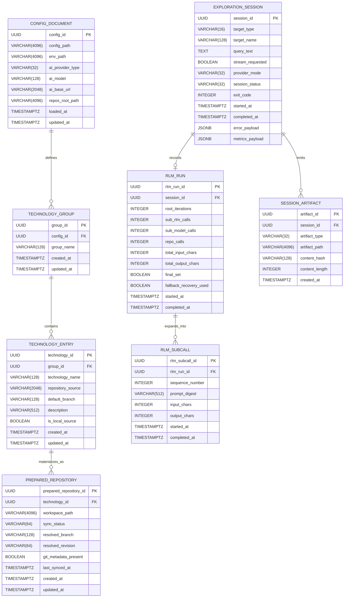

# Technical Specification: Librarian CLI

This document converts the current [PRD](/home/oscar/GitHub/librarian/docs/PRD.md) and [Architecture](/home/oscar/GitHub/librarian/docs/Architecture.md) into an implementation-grade physical specification for the existing brownfield system.

For strict non-CLI recursive exploration semantics, this specification is anchored to *Recursive Language Models* (Zhang, Kraska, Khattab, arXiv:2512.24601v2), especially the paper's Algorithm 1 and its distinctions from weaker long-context scaffolds.

## 1. Stack Specification (Bill of Materials)

### Runtime and Language

- **Language:** TypeScript 5.9.x
- **Primary Runtime:** Bun 1.3.x
- **Compatibility Floor:** Node.js 20+ compatibility surface for package consumers
- **Module System:** ESM only

### CLI and Core Libraries

- **CLI Framework:** `commander` 14.0.2
- **Schema Validation:** `zod` 4.2.1
- **YAML Parsing:** `yaml` 2.8.2
- **File Discovery:** `glob` 13.0.0
- **Git Operations:** `isomorphic-git` 1.36.1

### AI and Research Orchestration

- **Primary Non-CLI Orchestration Runtime:** Internal direct `RlmOrchestrator` path
- **Root Recursive Controller Contract:** dedicated root-model query factory
- **Sub-Model Analyzer Contract:** dedicated stateless sub-model query factory
- **Persistent Runtime Contract:** long-lived worker-backed REPL session for non-CLI `explore`
- **Provider Abstraction Runtime:** Vercel AI SDK Core (`ai`)
- **OpenAI Provider Adapter:** `@ai-sdk/openai`
- **Anthropic Provider Adapter:** `@ai-sdk/anthropic`
- **Google Provider Adapter:** `@ai-sdk/google`
- **OpenAI-Compatible Strategy:** AI SDK openai-compatible provider support where available
- **Custom Provider Strategy:** AI SDK custom providers for gaps such as non-standard compatible endpoints

### Persistence and Local State

- **Primary State Store:** Filesystem-backed workspace
- **Configuration Document Format:** YAML
- **Secrets Source:** `.env` file colocated with configuration
- **Prepared Repository Store:** Local cloned or referenced working directories
- **Operational Logs:** Timestamped structured log files under the user config directory
- **Application Database:** None in brownfield scope

### Build, Quality, and Packaging

- **Type Checking:** `tsc` via `bun run build:dev`
- **Test Runner:** Bun test runner
- **Formatting and Linting:** Biome 2.3.11
- **Package Manager:** Bun
- **Reproducible Packaging:** Nix Flakes + `bun2nix` 2.0.6
- **Distribution Targets:** npm package plus standalone Bun-compiled executable

### Physical Path Conventions

- **Primary config file:** `~/.config/librarian/config.yaml`
- **Primary env file:** `~/.config/librarian/.env`
- **Primary log directory:** `~/.config/librarian/logs/`
- **Primary repository workspace:** `~/.local/share/librarian/repos/{group}/{technology}`

## 2. Architecture Decision Records (ADRs)

### ADR-001 | Bun-First TypeScript CLI

- **Context:** The product is a local-first CLI with fast startup requirements, TypeScript-first development, and a packaging path that includes a standalone executable.
- **Decision:** Standardize on Bun 1.3.x as the primary runtime, package manager, build tool, and test runner, with TypeScript 5.9.x as the source language.
- **Consequences:** Startup, local execution, and standalone packaging remain simple for a solo developer. The cost is tighter coupling to Bun APIs and the need to keep Node compatibility expectations intentionally narrow.

### ADR-002 | Filesystem Workspace Instead of an Application Database

- **Context:** The Architecture explicitly rejects a relational database for current scope because state is operator-scoped, local, and configuration-driven.
- **Decision:** Persist product state as YAML configuration, local repository workspaces, and structured log files. Do not introduce PostgreSQL, SQLite, or any application-owned database in the brownfield baseline.
- **Consequences:** The system remains simple to install, inspect, and back up. The cost is weaker queryability for historical session data and more care required around file integrity and path conventions.

### ADR-003 | Dual Research Execution Paths

- **Context:** The current codebase supports both API-based reasoning providers and CLI-backed providers, and these modes have materially different execution characteristics.
- **Decision:** Keep two physical execution paths:
  API-backed providers use the direct internal RLM orchestration path backed by AI SDK Core model adapters.
  CLI-backed providers use provider-native subprocess execution with streaming passthrough.
- **Consequences:** The system preserves provider flexibility while removing both LangChain and ad hoc provider branching from the main `explore` path. The cost is more explicit orchestration ownership inside the codebase, tighter adapter design, and possible custom-provider work for endpoints that do not fit first-class AI SDK packages cleanly.

### ADR-004 | Worker-Isolated Sandbox for Research Execution

- **Context:** Repository exploration is the highest-risk execution surface in the product. The current architecture requires bounded investigation with failure isolation.
- **Decision:** Execute root-iteration code in a Bun Worker-based isolated runtime with a persistent worker session, explicit timeouts, scoped repository APIs, and environment metadata extraction after each iteration.
- **Consequences:** A hung or malformed research script is less likely to corrupt the main process, and root iterations can preserve locals and helper functions truthfully. The cost is IPC complexity, worker lifecycle management, and the fact that this remains a trusted-user isolation strategy, not hardened multi-tenant containment.

### ADR-005 | CLI-First Transport with Optional Local Automation Adapter

- **Context:** The product is CLI-first, but the tech-spec layer must define stable contracts for automation and future integration. The Architecture did not introduce a service plane.
- **Decision:** The CLI remains the only required transport. An optional loopback-only HTTP automation adapter may be implemented later, disabled by default, and must be treated as a thin wrapper over the same application services.
- **Consequences:** The default product remains simple and faithful to the current architecture. The cost is that OpenAPI becomes a secondary contract, not the primary user interface.

### ADR-006 | Split Root-Model and Sub-Model Query Contracts

- **Context:** Strict RLM behavior requires the root controller prompt and the sub-model analyzer prompt to have different semantics and different safety envelopes.
- **Decision:** Define two separate query factories:
  `createRootModelQuery()` for metadata-driven recursive control,
  `createSubModelQuery()` for stateless semantic analysis over transformed context.
- **Consequences:** The runtime contract becomes truthful and testable. The cost is more explicit interface surface and more AI SDK adapter plumbing, but the recursive loop remains framework-independent.

### ADR-008 | Preserve Algorithm-1 Completion Semantics

- **Context:** The paper's RLM loop terminates when environment state sets `Final`; it does not treat summarization of recent stdout as the normal success path.
- **Decision:** Treat `FINAL()` and `FINAL_VAR()` as the primary completion mechanism for non-CLI recursive runs. Any summarization fallback remains recovery-only and must be logged as non-normal completion.
- **Consequences:** Completion behavior stays faithful to the paper and easier to test. The cost is less tolerance for loose model behavior and more explicit recovery handling.

### ADR-007 | Structured Repository Environment Contract

- **Context:** Recursive exploration needs symbolic and programmatic repository access. A mixed contract of formatted text and structured data is too unstable.
- **Decision:** Standardize `repo.*` on structured return values for the sandbox runtime. If ergonomic text summaries are needed, expose separate text helpers rather than overloading the core contract.
- **Consequences:** Model-written code becomes more parseable, testable, and evolvable. The cost is slightly more verbosity inside generated scripts.

## 3. Database Schema (Physical ERD)

Brownfield note: there is no application database in the current architecture. This ERD defines the **canonical physical persistence model** that the filesystem-backed workspace must serialize, not a mandate to introduce a relational database.



### Serialization Rules

- `CONFIG_DOCUMENT`, `TECHNOLOGY_GROUP`, and `TECHNOLOGY_ENTRY` serialize into `config.yaml`.
- Secret values do not persist in `config.yaml`; they resolve from `.env` or provider-native CLI environments.
- `PREPARED_REPOSITORY` materializes as directory structure under `{repos_root_path}/{group}/{technology}`.
- `EXPLORATION_SESSION` and `SESSION_ARTIFACT` materialize as structured log records and optional temporary artifacts, not relational rows.
- `RLM_RUN` and `RLM_SUBCALL` materialize as structured execution-stat records linked by `session_id`, not relational rows.

## 4. API Contract (OpenAPI 3.0)

Brownfield note: the CLI is the primary transport. The following OpenAPI contract defines an **optional loopback-only automation adapter** that must remain disabled by default and delegate directly to the same application services used by the CLI.

```yaml
openapi: 3.0.3
info:
  title: Librarian Automation Adapter
  version: 0.3.0
  description: |
    Optional loopback-only HTTP adapter for Librarian CLI.
    Disabled by default. The canonical user interface remains the terminal CLI.
servers:
  - url: http://127.0.0.1:4317
    description: Loopback-only local adapter
security:
  - BearerAuth: []
components:
  securitySchemes:
    BearerAuth:
      type: http
      scheme: bearer
      bearerFormat: opaque
  schemas:
    CatalogTechnology:
      type: object
      required: [name, repositorySource]
      properties:
        name:
          type: string
        branch:
          type: string
          nullable: true
        description:
          type: string
          nullable: true
        repositorySource:
          type: string
    CatalogGroup:
      type: object
      required: [name, technologies]
      properties:
        name:
          type: string
        technologies:
          type: array
          items:
            $ref: '#/components/schemas/CatalogTechnology'
    CatalogResponse:
      type: object
      required: [groups]
      properties:
        groups:
          type: array
          items:
            $ref: '#/components/schemas/CatalogGroup'
    ExplorationRequest:
      type: object
      required: [query, targetType, targetName]
      properties:
        query:
          type: string
          minLength: 1
        targetType:
          type: string
          enum: [technology, group]
        targetName:
          type: string
        stream:
          type: boolean
          default: false
    ExplorationResponse:
      type: object
      required: [sessionId, targetType, targetName, status, response]
      properties:
        sessionId:
          type: string
          format: uuid
        targetType:
          type: string
          enum: [technology, group]
        targetName:
          type: string
        status:
          type: string
          enum: [completed, failed]
        response:
          type: string
        error:
          type: object
          nullable: true
          properties:
            code:
              type: string
            message:
              type: string
    ErrorResponse:
      type: object
      required: [error]
      properties:
        error:
          type: object
          required: [code, message]
          properties:
            code:
              type: string
            message:
              type: string
paths:
  /v1/catalog:
    get:
      summary: List all configured technology groups and technologies
      operationId: listCatalog
      responses:
        '200':
          description: Catalog returned
          content:
            application/json:
              schema:
                $ref: '#/components/schemas/CatalogResponse'
        '400':
          description: Invalid request
          content:
            application/json:
              schema:
                $ref: '#/components/schemas/ErrorResponse'
        '401':
          description: Missing or invalid bearer token
          content:
            application/json:
              schema:
                $ref: '#/components/schemas/ErrorResponse'
        '500':
          description: Unexpected adapter failure
          content:
            application/json:
              schema:
                $ref: '#/components/schemas/ErrorResponse'
  /v1/catalog/groups/{groupName}:
    get:
      summary: Return one configured technology group
      operationId: getGroup
      parameters:
        - in: path
          name: groupName
          required: true
          schema:
            type: string
      responses:
        '200':
          description: Group returned
          content:
            application/json:
              schema:
                $ref: '#/components/schemas/CatalogGroup'
        '400':
          description: Invalid group name
          content:
            application/json:
              schema:
                $ref: '#/components/schemas/ErrorResponse'
        '401':
          description: Missing or invalid bearer token
          content:
            application/json:
              schema:
                $ref: '#/components/schemas/ErrorResponse'
        '404':
          description: Group not found
          content:
            application/json:
              schema:
                $ref: '#/components/schemas/ErrorResponse'
        '500':
          description: Unexpected adapter failure
          content:
            application/json:
              schema:
                $ref: '#/components/schemas/ErrorResponse'
  /v1/explorations:
    post:
      summary: Execute a non-streaming exploration against a technology or group
      operationId: createExploration
      requestBody:
        required: true
        content:
          application/json:
            schema:
              $ref: '#/components/schemas/ExplorationRequest'
      responses:
        '201':
          description: Exploration completed and response returned
          content:
            application/json:
              schema:
                $ref: '#/components/schemas/ExplorationResponse'
        '400':
          description: Invalid request payload or invalid target selector
          content:
            application/json:
              schema:
                $ref: '#/components/schemas/ErrorResponse'
        '401':
          description: Missing or invalid bearer token
          content:
            application/json:
              schema:
                $ref: '#/components/schemas/ErrorResponse'
        '404':
          description: Technology or group not found
          content:
            application/json:
              schema:
                $ref: '#/components/schemas/ErrorResponse'
        '500':
          description: Repository preparation or reasoning execution failed
          content:
            application/json:
              schema:
                $ref: '#/components/schemas/ErrorResponse'
```

## 5. Implementation Guidelines

### Project Structure

```text
src/
├── app/
│   ├── cli/
│   │   ├── commands/
│   │   │   ├── list.command.ts
│   │   │   ├── explore.command.ts
│   │   │   └── config.command.ts
│   │   └── presenters/
│   │       ├── list.presenter.ts
│   │       └── exploration.presenter.ts
│   └── automation/
│       └── http/
│           ├── server.ts
│           └── routes/
├── domain/
│   ├── catalog/
│   │   ├── entities.ts
│   │   ├── value-objects.ts
│   │   └── policies.ts
│   ├── exploration/
│   │   ├── entities.ts
│   │   ├── services.ts
│   │   └── errors.ts
│   ├── repository-preparation/
│   │   ├── entities.ts
│   │   └── policies.ts
│   └── workspace/
│       ├── entities.ts
│       └── policies.ts
├── application/
│   ├── commands/
│   │   ├── list-catalog.command.ts
│   │   ├── explore-technology.command.ts
│   │   └── explore-group.command.ts
│   ├── queries/
│   │   └── get-config-path.query.ts
│   └── ports/
│       ├── catalog-store.port.ts
│       ├── repository-sync.port.ts
│       ├── reasoning.port.ts
│       ├── sandbox.port.ts
│       └── logger.port.ts
├── infrastructure/
│   ├── config/
│   │   ├── yaml-config.store.ts
│   │   └── env-loader.ts
│   ├── git/
│   │   └── isomorphic-git.repository-sync.ts
│   ├── reasoning/
│   │   ├── create-root-model-query.ts
│   │   ├── create-sub-model-query.ts
│   │   ├── claude-cli.adapter.ts
│   │   ├── gemini-cli.adapter.ts
│   │   └── codex-cli.adapter.ts
│   ├── sandbox/
│   │   ├── persistent-worker-session.ts
│   │   ├── environment-metadata.ts
│   │   ├── rlm-orchestrator.ts
│   │   └── repo-api.adapter.ts
│   ├── logging/
│   │   └── file-logger.ts
│   └── tools/
│       ├── file-listing.tool.ts
│       ├── file-reading.tool.ts
│       ├── grep-content.tool.ts
│       └── file-finding.tool.ts
├── contracts/
│   ├── config/
│   │   └── config.schema.ts
│   ├── context/
│   │   └── agent-context.schema.ts
│   └── openapi/
│       └── automation-adapter.openapi.yaml
└── utils/
```

### Coding Standards

- All business rules for catalog resolution, exploration targeting, and workspace policy must live in `src/domain` or `src/application`, never inside CLI handlers or provider adapters.
- `src/domain` must not import Bun APIs, filesystem APIs, Git clients, AI SDK packages, or subprocess utilities.
- Every external dependency must enter through an application port in `src/application/ports`.
- Provider-specific behavior and AI SDK package usage must be isolated under `src/infrastructure/reasoning`; no provider switch statements are allowed in domain services.
- Non-CLI `explore` must route directly to `RlmOrchestrator.run(query)`; it must not pass through a framework-owned tool-agent loop in the main execution path.
- Root-model and sub-model inference must use separate factories and separate prompts. The root controller prompt must never be reused for `llm_query()` or child recursive analysis.
- Root-model and sub-model inference for non-CLI providers must be implemented through AI SDK Core-backed adapters behind those separate factories; AI SDK tool-calling features are not the control plane for RLM execution.
- The root controller prompt must receive metadata only:
  workspace identity, repo outline, environment summaries, buffer and variable summaries, stdout previews, and error metadata.
  It must not receive a prebuilt full repository snapshot as normal operating context.
- `sub_rlm()` must accept a structured recursive task object such as `{ prompt, context, rootHint? }` and must launch a child recursive run. It must not use raw script evaluation as its primary contract.
- Persistent REPL state must preserve locals, helper functions, symbolic selections, and final-answer bindings across root iterations. Persisting only exported buffers is insufficient.
- Workspace path validation must be centralized in one policy module; duplicate traversal checks across adapters are not allowed.
- The repository environment contract must be structured and stable. Core `repo.*` methods must return typed or JSON-serializable values; human-optimized summaries belong in separate helper methods.
- Environment failures must cross adapter boundaries as typed results or thrown errors, never as opaque success-shaped strings.
- The optional HTTP automation adapter must be a thin adapter over the same application commands as the CLI. It must not introduce separate orchestration logic.
- All request/response schemas must be defined once in `src/contracts` and reused across CLI validation, automation adapter validation, and tests.
- Logs must be structured JSON lines or JSON-serializable metadata entries with mandatory fields:
  `session_id`, `component`, `operation`, `status`, `duration_ms`.
- Non-CLI exploration logs must also carry:
  `root_iterations`, `sub_rlm_calls`, `sub_model_calls`, `repo_calls`, `total_input_chars`, `total_output_chars`, `final_set`, `fallback_recovery_used`.
- Timeout values must be constants in infrastructure configuration, not inline literals scattered across modules.
- Streaming output adapters must normalize provider-specific chunk formats into a single application-level stream event shape before presentation.
- Fallback summarization after loop exhaustion may exist only as explicit runtime recovery. It must be marked as failure-adjacent behavior and counted in run stats.
- Non-CLI RLM behavior must be evaluated against the paper's semantics, not against generic agent success. A run is only "RLM-aligned" when prompt externalization, persistent REPL state, symbolic recursion, and environment-owned completion all hold together.
- Tests must mirror the architecture:
  domain tests with no filesystem or network,
  application tests with port fakes,
  infrastructure tests for provider and sandbox behavior,
  integration tests for end-to-end CLI workflows.
- RLM-specific tests must cover:
  root and sub prompts are different,
  root controller never receives a full repository preload,
  locals persist across root iterations,
  `sub_rlm()` launches child recursive runs,
  `FINAL_VAR()` returns active environment state,
  and the repository contract stays stable.

### Brownfield Refactor Policy

- Existing files may remain in place during transition, but every net-new module must follow the target layout above.
- Refactors must be vertical and incremental:
  extract one context at a time,
  preserve command behavior,
  then move the next responsibility.
- Do not introduce a relational database, message queue, or hosted control plane in this phase.

## Verification Notes

- Bun 1.3 capabilities and build/runtime choices were checked against Bun official documentation and Bun 1.3 release material.
- AI SDK Core and provider/model abstraction were checked against Vercel AI SDK official documentation, especially the Foundations overview and Providers and Models pages.
- One important caveat from the AI SDK provider docs is that provider coverage is broad but not uniform, so endpoints that do not map cleanly onto first-class provider packages should be isolated behind custom AI SDK providers rather than leaking compatibility quirks into orchestration code.

### Source Links

- Recursive Language Models paper: https://arxiv.org/html/2512.24601v2
- AI SDK Foundations Overview: https://ai-sdk.dev/docs/foundations/overview.md
- AI SDK Providers and Models: https://ai-sdk.dev/docs/foundations/providers-and-models.md
- AI SDK Core `generateText()`: https://ai-sdk.dev/docs/reference/ai-sdk-core/generate-text.md
